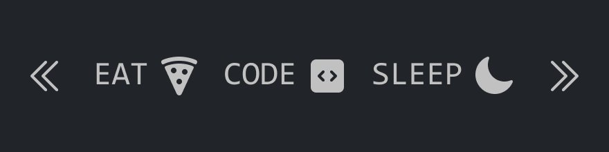

# Hey there 👏.

I'm a passionate young peruvian guy for web development, Front-end exactly. You can go to check some of my projects if you like. Hope you like them :)

## Personal information

```js
const user = {
  firstName: "Marcelo",
  lastName: "Garro",
  age: "20",
  email: "marcelogarro137@gmail.com",
  nickname: "SgtGarro",
  occupation: "student",
};

const phrase = "Don't stop learning!";
```

## Languages and Frameworks

### Mainly Languages

Like any normal Front-end developer, I learn a lot about HTML, CSS and JavaScript, but I focus more on JavaScript more than any other language.

<div align="left">
  
  
  
</div>

### Frameworks

I like to use React and Tailwind together. It's a good combination.

<div align="left">
  
  
  
</div>
          
### Other languages that I learned or be learning
I don't want to only study or work web development for the rest of my life. So that's why I decided to study some other languages :D

<div align="left">
  
  
</div>
